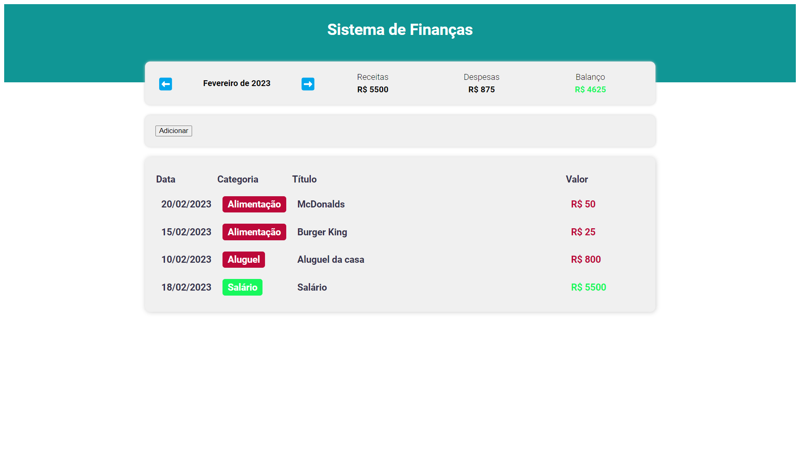

<h1 align="center">Expense-tracker</h1>

Expense-tracker é um rastreador de despesas.  

 

  

## 🚀 Tecnologias

Esse projeto foi desenvolvido com as seguintes tecnologias:

- Typescript
- React 
- Styled-components
- Git e Github
- Vite

## 💻 Projeto

Expense-tracker é um rastreador de despesas monitorando os gastos do usuário, para uso pessoal, obs: projeto em teste...

- [Visite o projeto online](https://expense-tracker-pi-murex.vercel.app/)
